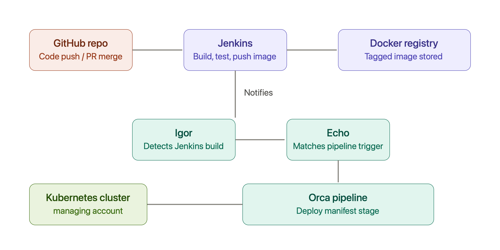

# End-to-End CI/CD Pipeline

## GitHub → Jenkins → Docker Registry → Spinnaker → Kubernetes



A production-style CI/CD pipeline that automatically builds, tests, packages, and deploys applications to Kubernetes using **Jenkins**, **Docker**, and **Spinnaker** while following a **GitOps** approach for Kubernetes manifests.

---

# 📖 Overview

This project demonstrates a complete Continuous Integration and Continuous Deployment (CI/CD) workflow.

Whenever code is pushed to GitHub:

1. Jenkins is triggered via a GitHub webhook.
2. Jenkins builds and tests the application.
3. A Docker image is created and pushed to a Docker registry.
4. Jenkins publishes the image details as a build artifact.
5. Spinnaker detects the successful Jenkins build.
6. Spinnaker downloads the Kubernetes manifest directly from GitHub.
7. The image tag inside the manifest is replaced dynamically.
8. The updated manifest is deployed to Kubernetes.

This architecture keeps deployment manifests inside Git while allowing Spinnaker to deploy the latest application image automatically.

---

# 🏗️ Architecture

```
                 +--------------------+
                 |      GitHub        |
                 | Code Push / Merge  |
                 +---------+----------+
                           |
                           |
                           ▼
                 +--------------------+
                 |      Jenkins       |
                 | Build • Test       |
                 | Build Docker Image |
                 | Push Image         |
                 +---------+----------+
                           |
                           |
                           ▼
                 +--------------------+
                 | Docker Registry    |
                 | Tagged Images      |
                 +--------------------+

                           |
                           |
                 Jenkins Notification
                           |
                           ▼

               +----------------------+
               |        Igor          |
               +----------+-----------+
                          |
                          ▼
               +----------------------+
               |        Echo          |
               +----------+-----------+
                          |
                          ▼
               +----------------------+
               |   Orca Pipeline      |
               | Deploy Manifest      |
               +----------+-----------+
                          |
                          ▼
               +----------------------+
               | Kubernetes Cluster   |
               +----------------------+
```

---

# 📂 Repository Structure

```text
.
├── app/
│   ├── app.py
│   ├── requirements.txt
│   └── Dockerfile
│
├── Jenkinsfile
│
├── k8s/
│   └── manifest.yaml
│
├── spinnaker/
│   └── pipeline.json
│
├── cicd_workflow_overview.png
│
└── README.md
```

---

# 🚀 CI/CD Workflow

## Step 1 - Developer Pushes Code

Developers push code or merge a Pull Request into GitHub.

```
Developer
      │
      ▼
 GitHub Repository
```

---

## Step 2 - Jenkins Pipeline

A GitHub webhook automatically triggers Jenkins.

The Jenkins pipeline performs the following actions:

- Checkout source code
- Install dependencies
- Run unit tests
- Build Docker image
- Tag Docker image
- Push Docker image
- Generate build metadata

Example generated artifact:

```properties
IMAGE_NAME=demo-app
IMAGE_TAG=15
FULL_IMAGE=docker.io/demo/demo-app:15
```

This file is archived as a Jenkins build artifact.

---

## Step 3 - Docker Registry

The Docker image is pushed to your registry.

Example:

```
docker.io/demo/demo-app:15
```

This image becomes the deployment artifact.

---

## Step 4 - Spinnaker Trigger

Spinnaker continuously monitors Jenkins.

When Jenkins finishes successfully:

- Igor detects the completed build
- Echo matches the pipeline trigger
- Orca starts the deployment pipeline

```
Jenkins
   │
   ▼
 Igor
   │
   ▼
 Echo
   │
   ▼
 Orca Pipeline
```

---

## Step 5 - Fetch Kubernetes Manifest

Instead of embedding Kubernetes YAML inside Spinnaker, the Deploy Manifest stage downloads the manifest directly from GitHub.

Example:

```
https://raw.githubusercontent.com/<org>/<repo>/main/k8s/manifest.yaml
```

Advantages:

- Version controlled
- Pull Request reviews
- Git history
- Easier maintenance

---

## Step 6 - Dynamic Image Replacement

The Kubernetes manifest contains:

```yaml
image: ${trigger['properties']['FULL_IMAGE']}
```

At deployment time Spinnaker replaces it with:

```yaml
image: docker.io/demo/demo-app:15
```

No manual editing is required.

---

## Step 7 - Deploy to Kubernetes

Spinnaker applies the manifest.

Kubernetes performs a rolling update.

Verify deployment:

```bash
kubectl get pods -n demo

kubectl get deployment demo-app -n demo \
-o jsonpath='{.spec.template.spec.containers[0].image}'
```

---

# ⚙️ Prerequisites

Install the following:

- Git
- Docker
- Kubernetes Cluster
- kubectl
- Jenkins
- Spinnaker
- GitHub Repository
- Docker Registry

---

# 🔧 Installation

## 1. Clone Repository

```bash
git clone https://github.com/<username>/<repo>.git

cd <repo>
```

---

## 2. Create Namespace

```bash
kubectl create namespace demo
```

---

## 3. Configure Jenkins

Create a new Pipeline Job.

Pipeline Type

```
Pipeline Script from SCM
```

Configure

- Git Repository
- Credentials
- Branch
- Jenkinsfile

Enable

```
GitHub hook trigger for GITScm polling
```

---

## 4. Docker Registry Credentials

Navigate to

```
Manage Jenkins
    ↓
Credentials
    ↓
System
    ↓
Global Credentials
```

Create

```
Username with Password
```

Credential ID

```
docker-registry-creds
```

Update the following inside the Jenkinsfile:

```groovy
REGISTRY
IMAGE_NAME
```

---

## 5. Configure GitHub Webhook

Repository

```
Settings
    ↓
Webhooks
    ↓
Add Webhook
```

Payload URL

```
http://<jenkins-url>/github-webhook/
```

Content Type

```
application/json
```

Events

```
Push
```

---

## 6. Enable HTTP Artifact Account

Check whether the HTTP artifact account already exists.

```bash
kubectl get cm clouddriver-<config> -n spinnaker -o yaml
```

If missing, add:

```yaml
artifacts:
  http:
    enabled: true
    accounts:
      - name: no-auth-http-account
```

Restart Clouddriver.

```bash
kubectl rollout restart deployment clouddriver -n spinnaker
```

Verify:

```bash
curl -sk -b cookies.txt \
https://<spinnaker>/api/v1/artifacts/credentials | jq
```

Expected output should include:

```
no-auth-http-account
```

---

## 7. Create Spinnaker Application

Create a new application.

```
Name

demoapp
```

---

## 8. Import Pipeline

```bash
curl -sk -b cookies.txt \
-X POST \
https://<spinnaker>/api/v1/pipelines \
-H "Content-Type: application/json" \
-d @spinnaker/pipeline.json
```

---

## 9. Update Jenkins Job Name

Inside

```
spinnaker/pipeline.json
```

Update

```json
"job": "demo-app-build"
```

to match your Jenkins Job.

Re-import the pipeline.

---

# 🧪 Testing

Push a commit.

The pipeline executes automatically.

```
GitHub
    │
    ▼
Jenkins
    │
    ▼
Docker Registry
    │
    ▼
Spinnaker Trigger
    │
    ▼
Deploy Manifest
    │
    ▼
Kubernetes
```

Verify

```bash
kubectl get pods -n demo

kubectl get svc -n demo

kubectl get deployment demo-app -n demo
```

---

# 🔍 Verification

Verify the deployed image.

```bash
kubectl get deployment demo-app \
-n demo \
-o jsonpath='{.spec.template.spec.containers[0].image}'
```

Example

```
docker.io/demo/demo-app:15
```

---

# 📈 Why GitOps?

This project follows GitOps principles.

Benefits include:

- Kubernetes manifests remain inside Git.
- Every deployment configuration change is version controlled.
- Pull Requests review infrastructure changes.
- Rollbacks are simple using Git history.
- No YAML duplication inside Spinnaker.
- Pipelines remain generic and reusable.

---

# 🛠️ Troubleshooting

## Jenkins builds successfully but Spinnaker does not trigger

Check:

- Jenkins trigger configuration
- Igor logs
- Echo logs

---

## Manifest download fails

Verify:

- Raw GitHub URL
- HTTP Artifact Account
- Clouddriver logs

---

## Image tag not updated

Verify that Jenkins publishes:

```properties
FULL_IMAGE=
```

Verify the Kubernetes manifest contains:

```yaml
image: ${trigger['properties']['FULL_IMAGE']}
```

---

## Kubernetes deployment fails

Check

```bash
kubectl describe pods -n demo

kubectl logs <pod-name> -n demo
```

---

# 📚 Technologies Used

| Technology | Purpose |
|------------|----------|
| GitHub | Source Code Management |
| Jenkins | Continuous Integration |
| Docker | Containerization |
| Docker Registry | Image Storage |
| Spinnaker | Continuous Deployment |
| Kubernetes | Container Orchestration |
| GitOps | Manifest Management |

---

# 📌 Future Enhancements

- Helm deployment support
- ArgoCD integration
- Blue/Green deployments
- Canary deployments
- Manual approval stages
- Slack notifications
- SonarQube integration
- Trivy image scanning
- Prometheus monitoring
- Grafana dashboards
- Rollback automation

---

# 🤝 Contributing

Contributions are welcome.

1. Fork the repository.
2. Create a feature branch.
3. Commit your changes.
4. Push your branch.
5. Open a Pull Request.

---


---

## ⭐ If you found this project useful, consider giving it a star!